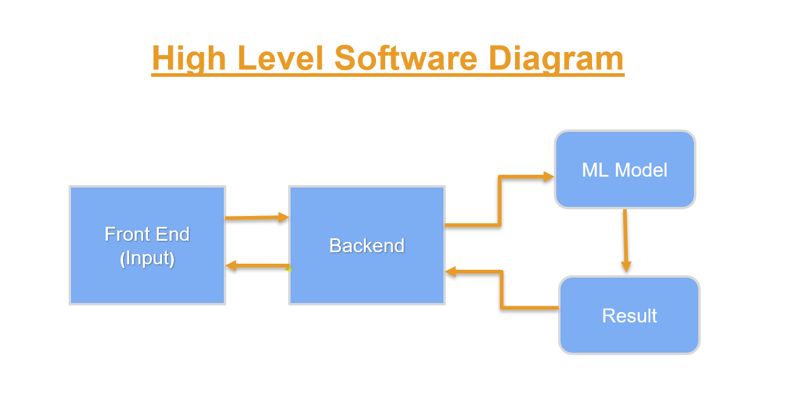
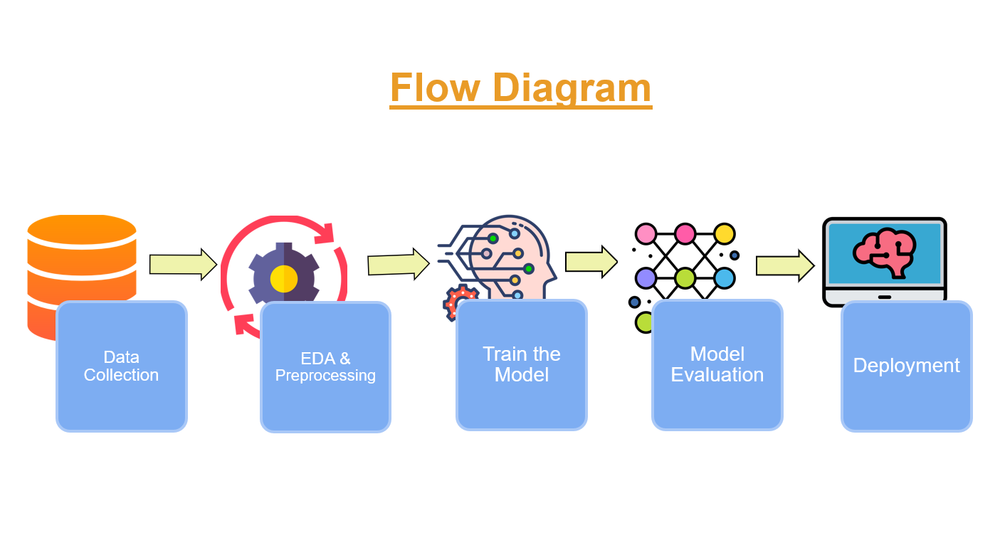
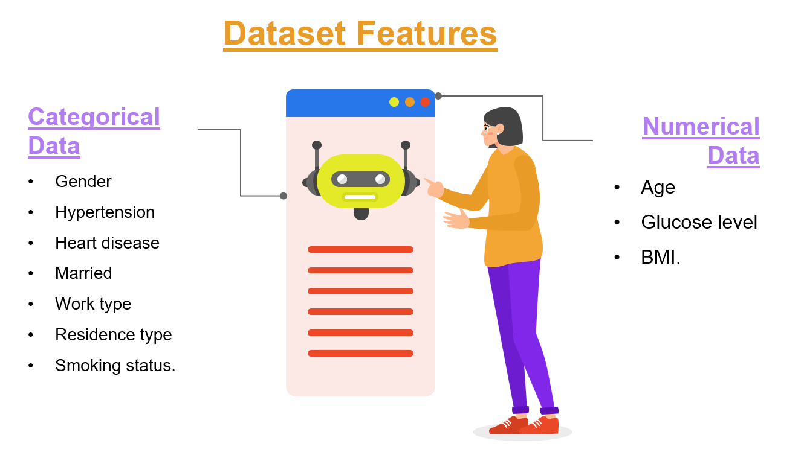
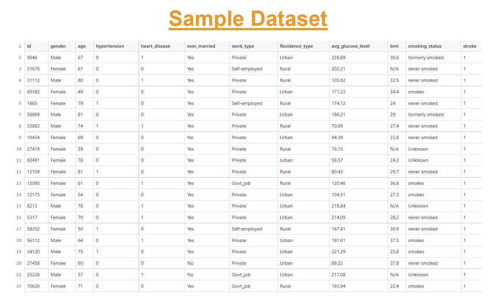

# Stroke Prediction Using Machine Learning

* Developed a machine learning model to predict stroke risk using a tabular dataset with medical features.
* Applied various ML techniques to analyze and predict stroke likelihood based on input features.
* Deployed the model for testing purposes as a web form application for real-time stroke risk prediction based on user-provided medical information.

